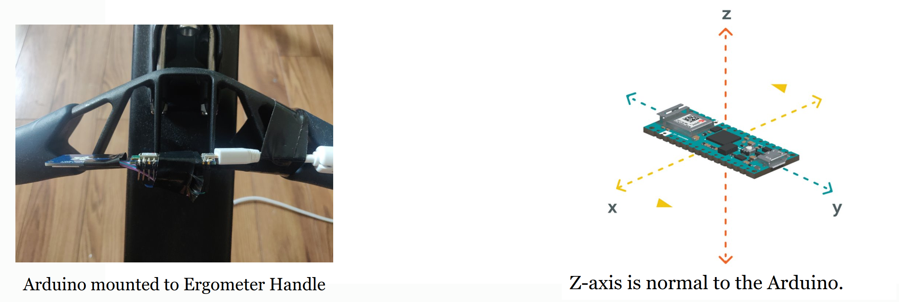

# SportSonification

This project focused on the sonification of accelerometer data captured from the handle of a rowing ergometer.

## Built Using

This project was built using the following technologies:

- Arduino Nano 33IoT
- Adafruit SD Card Reader
- libmapper
- FAUST

## Demo

This figure shows how the arduino was mounted to the ergometer.

This screenshot shows the combination of a video capture and accelerometer data from a short rowing ergometer clip. The full video is avaliable on YouTube by clicking [here](https://youtu.be/hntFUQYL8Ns).

A video demo of the entire sonification system working is available [here](https://youtu.be/oBo2xh0Tmmg).

## Presentation

A copy of the slide show used for my final presentation of this project is available [here]("MultimediaReport.pdf).
